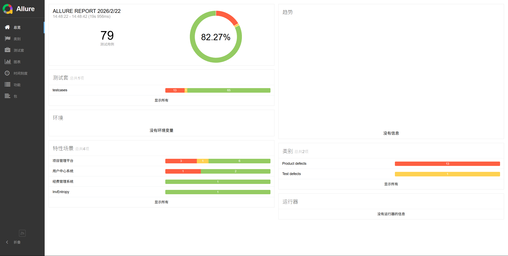

# coco-autotest

> 轻量级接口自动化测试框架

### 技术栈

Python · Pytest · Requests · Allure · OpenAI API · Swagger

---

## 简介

基于数据驱动的接口自动化测试框架，解决手工测试效率低、回归成本高、接口质量难监控的问题。只需编写 YAML 配置文件即可新增用例，支持多环境切换与 Allure 可视化报告。



---

## 核心特性

| 特性 | 说明 |
|------|------|
| 多环境适配 | 开发/测试/生产一键切换，无需修改用例代码 |
| 数据驱动 | YAML 解耦用例数据，新增用例仅需编写配置文件 |
| 可视化报告 | Allure 生成详细报告，本地一键查看 |
| CI/CD | 代码提交自动触发测试与报告部署 |
| 开箱即用 | 运行脚本一键启动，零门槛上手 |
| 智能生成 (Beta) | 集成 OpenAI API，自动生成测试用例与数据 |

---

## 快速开始

### 1. 安装依赖

```bash
pip install -r requirements.txt
```

### 2. 配置环境

在项目根目录创建 `.env` 文件，填写被测服务地址：

```env
SERVER_URL=http://localhost:8080
```

### 3. 运行测试

```bash
# 方式一：命令行启动
pytest

# 方式二：一键启动（自动生成 Allure 报告）
python start.py
```

### 4. 查看报告

```bash
allure serve temps
```

---

## 项目结构

```
coco-autotest/
├── common/          # 公共模块（请求封装、断言检查、配置加载）
├── utils/           # 工具模块（数据解析、RSA加密、Allure工具）
├── testcases/       # 测试用例（Python）
├── data/            # 测试数据（YAML）
│   ├── ai_testcases/  # AI 生成的用例数据
│   └── test_data/     # 手动编写的用例数据
├── ai_auto_testcases/ # AI 用例生成器
├── conftest.py      # pytest 全局 fixtures
├── start.py         # 一键启动入口
└── pytest.ini       # pytest 配置
```

---

## 编写测试用例

采用 YAML 数据驱动，每个用例包含三步：请求 → 断言 → 提取。详细模板说明见 [YAML 模板使用说明](docs/YAML%E6%A8%A1%E6%9D%BF%E4%BD%BF%E7%94%A8%E8%AF%B4%E6%98%8E.md)。


---

## CI/CD 工作流

提交代码自动触发：安装依赖 → 运行测试 → 生成 Allure 报告 → 部署到 Pages
